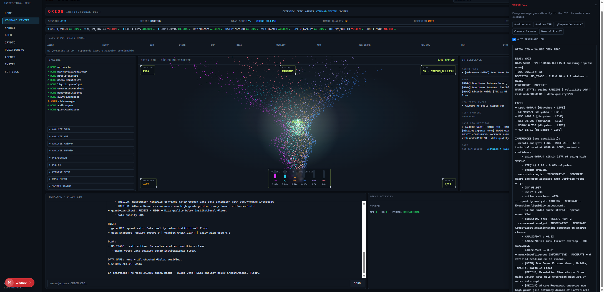
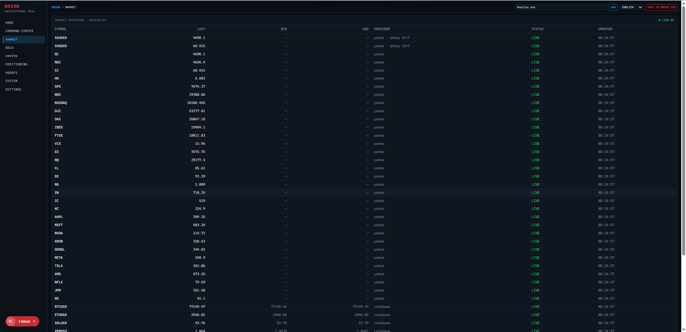
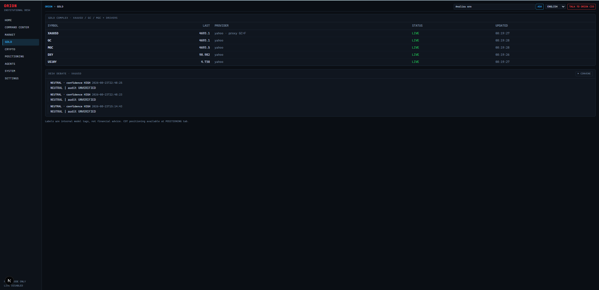
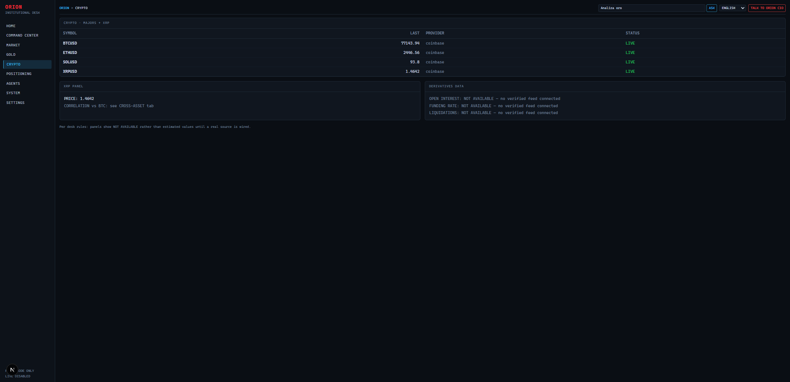
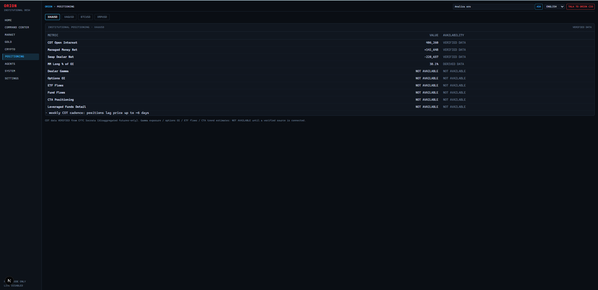
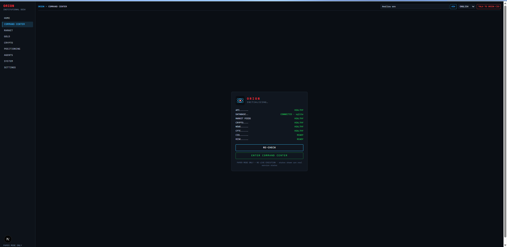

# ORION INSTITUTIONAL TRADING DESK

Plataforma local, modular y multiagente que simula una **mesa institucional de trading**:
especialistas que analizan en paralelo, discrepan con evidencias, asignan probabilidades,
y un Chief Risk Manager con poder de veto — todo auditable, en modo paper por defecto.

> ⚠️ **No es asesoramiento financiero.** Las clasificaciones internas (STRONG BUY BIAS,
> etc.) son salidas de modelo para uso investigador. La ejecución real está desactivada
> por defecto y requiere autorización humana explícita.

> 🔒 **Acceso privado.** Este repositorio es de código propietario, no de código abierto.
> El acceso se concede únicamente a quien lo adquiere directamente — ver
> [Licencia](#licencia).

## ¿Qué es ORION — y qué NO es?

**ORION no es un bot.** No abre, cierra ni gestiona posiciones por ti, no tiene ninguna
conexión activa a un bróker, y no existe ningún camino en el código que ejecute una orden
sin aprobación humana explícita. Lo que hace es el trabajo que haría un analista senior
antes de que tú decidas: reunir los datos, contrastarlos entre especialistas, y entregarte
una lectura honesta — incluida la opción de no operar.

Lo que ORION sí hace, en cada consulta:

- **Calcula el BIAS de forma explícita** — no una intuición, sino una puntuación (`BIAS
  SCORE`) y una banda (`STRONG_BULLISH`, `NEUTRAL`, etc.) construida a partir de las
  inferencias de cada especialista, visible siempre junto a su confianza.
- **Es disciplinado sobre la dirección.** La doctrina interna separa contexto, liquidez,
  nivel, reacción, confirmación, riesgo y ejecución. Un sweep o un BIAS fuerte no es una
  entrada por sí solo: se exige nivel + reacción + confirmación + R:R mínimo 1:2. Sin eso,
  la decisión por defecto es `WAIT` o `NO_TRADE` — ORION prefiere no equivocarse de
  dirección a forzar una operación.
- **Mide volumen real**, no simulado. Los futuros/índices/acciones usan el volumen de las
  últimas barras de 1 minuto vía Yahoo Finance; BTC/ETH/SOL/XRP usan el volumen de 24h real
  de Coinbase Exchange. Cuando un instrumento no tiene volumen centralizado real disponible
  (por ejemplo, forex spot como EURUSD), ORION lo muestra como `N/A` en vez de inventar un
  número — la ausencia de dato se comunica, nunca se disimula.
- **Lee y filtra noticias importantes.** El especialista de noticias identifica titulares de
  alto impacto (`[HIGH]`/`[MEDIUM]`) y los conecta con el activo en cuestión como riesgo de
  evento — por ejemplo, un titular sobre Ripple se marca como *event-risk*, nunca convierte
  automáticamente la lectura de XRP en LONG.
- **Un Chief Risk Manager con veto.** Cualquier idea, por fuerte que sea el BIAS, puede ser
  bloqueada por el gestor de riesgo (`gate RED · quant veto`, calidad de datos insuficiente,
  etc.) antes de convertirse siquiera en una propuesta.
- **Transparencia total del origen del dato.** Cada hecho que cita el CIO lleva su fuente y
  estado (`LIVE`, `STALE`, `SIMULATED`, `NOT AVAILABLE`) — si un feed no está disponible
  (por ejemplo, funding/OI de derivados cripto o flujos de ETF), la app lo dice
  explícitamente en vez de rellenar el hueco.

## Arquitectura de la mesa

12 agentes especialistas (macro, metales, forex, cripto, equities, liquidez, positioning,
cross-asset, noticias, quant, riesgo, auditoría) analizan cada consulta de forma
determinista y en paralelo. El **CIO** sintetiza sus lecturas en una respuesta estructurada:

```
BIAS → DECISION → MARKET STATE → FACTS (dato + fuente + estado)
→ INFERENCES (una línea por especialista: postura · confianza · resumen)
→ RISK → PLAN → DATA GAPS → SESSIONS ACTIVE → resumen en lenguaje llano
```

Ningún especialista ejecuta operaciones. Toda señal declara: activo, timestamp, fuente,
precio, timeframe, dirección, entrada, invalidación, SL, objetivos, R:R, probabilidad,
confianza, horizonte, razonamiento técnico/fundamental, catalizadores, riesgos, liquidez,
condiciones de activación y de cancelación.

```
MARKET DATA → SPECIALIST AGENTS → STRATEGY/QUANT → CIO/DESK HEAD
→ CHIEF RISK MANAGER (veto) → TRADE PROPOSAL → EXECUTION GATEWAY
→ PAPER / HUMAN-APPROVED LIVE
```

## Command Center — voz interactiva y núcleo 3D en vivo

El Command Center (`/command`) es la vista principal de la mesa: estado real de servicios,
ticker en vivo, radar de oportunidades, timeline de agentes, terminal multiagente y el chat
directo con el CIO.

- **Voz interactiva (ES/EN).** Tras cada lectura del CIO, ORION narra en voz — no un texto
  inventado, sino el resumen en lenguaje llano y las conclusiones de los especialistas que
  el propio CIO acaba de generar — para que puedas seguir el análisis sin leer.
- **Núcleo ORION en 3D (three.js/WebGL).** Una nube de partículas trunk-to-canopy que gira
  en vivo: el centro — la "cabeza" de ORION — es siempre verde y siempre está activo, pulsa
  de forma constante como identidad fija del sistema. A su alrededor, cada activo seguido
  tiene su propio color (oro en fucsia, BTC en naranja, XRP en azul, etc.) y su volumen
  relativo real empuja ese sector de la espiral hacia afuera — el volumen que entra en cada
  activo se ve, no solo se lee.
- **Panel de flujo de volumen en vivo**, con barras y cifras numéricas por activo,
  actualizándose en tiempo real, y `N/A` honesto cuando el instrumento no tiene dato de
  volumen centralizado (spot FX).
- El arranque (`INITIALIZING…`) valida en vivo cada servicio (API, base de datos, feeds de
  mercado, cripto, noticias, CFTC, CIO, riesgo) y muestra explícitamente cualquier feed
  degradado o no disponible antes de dejarte operar con la mesa.

## Capturas

| | |
|---|---|
|  **Command Center** — núcleo 3D en vivo, HUD de sesión/régimen/BIAS/decisión, panel de volumen por activo y lectura completa del CIO sobre XAUUSD. |  **Market** — watchlist completa con precios LIVE reales (Yahoo/Coinbase) de metales, índices, energía, acciones y cripto. |
|  **Gold** — complejo de oro (XAUUSD/GC/MGC/DXY/US10Y) e historial de debates de la mesa. |  **Crypto** — cotizaciones en vivo de BTC/ETH/SOL/XRP, con `NOT AVAILABLE` honesto para derivados (funding, OI, liquidaciones) cuando no hay feed verificado. |
|  **Positioning** — datos reales de posicionamiento CFTC COT (Open Interest, Managed Money Net, Swap Dealer Net), con `NOT AVAILABLE` honesto para gamma/OI de opciones/flujos de ETF. |  **Arranque** — verificación en vivo de cada servicio (API, base de datos, feeds, cripto, noticias, CFTC, CIO, riesgo) antes de operar. |

## Componentes

| Módulo | Descripción |
|---|---|
| `apps/api` | FastAPI: market data, chat multiagente, propuestas, riesgo, estado |
| `apps/web` | Dashboard Next.js oscuro estilo terminal + Desk Room + Command Center 3D + voz |
| `apps/monitor` | `orion-monitor`: proceso persistente (feeds, schedulers, alertas) |
| `core/` | Event bus, market data adapters, risk engine, execution gateway, memoria, scanner de volumen relativo |
| `providers/` | Yahoo Finance (volumen/precio real), Coinbase Exchange (volumen/precio cripto real), TradingView webhook, Polymarket (Gamma/CLOB), interfaces brokers |
| `.opencode/` | 13 agentes LLM reales (CIO, Risk, Macro, News, Equities, Crypto, Metals, Liquidity, Quant, Execution, Polymarket, Research, Market Data Engineer) + comandos de mesa |

## Inicio rápido (sin Docker — Windows)

Requisitos: Python 3.12+ (probado 3.13), Node 20+.

```powershell
# Backend
python -m venv .venv
.\.venv\Scripts\Activate.ps1
pip install -r requirements.txt
copy .env.example .env          # editar valores si procede
python -m core.memory.init_db   # crea SQLite dev

# API  → http://127.0.0.1:8000/docs
uvicorn apps.api.main:app --reload --port 8000

# Monitor persistente (otra terminal)
python -m apps.monitor.main

# Frontend → http://localhost:3000 (otra terminal)
cd apps/web; npm install; npm run dev
```

## Inicio rápido (Docker)

```bash
docker compose up --build
```

## Command Center

Con API y frontend iniciados, abre `http://localhost:3000/command`. El Command Center
muestra el estado real de servicios, ticker, inteligencia, actividad del CIO, el núcleo 3D
con volumen en vivo por activo y la voz interactiva, y la terminal multiagente. El arranque
indica explícitamente feeds degradados o datos no disponibles.

## Launcher de escritorio (Windows)

Desde PowerShell en la raíz del repositorio:

```powershell
Set-ExecutionPolicy -Scope Process Bypass
.\scripts\install_orion_desktop.ps1
```

El acceso directo crea o actualiza `ORION Institutional Desk.lnk` en el Escritorio y
abre `/command` en Edge o Chrome App Mode cuando están disponibles. El launcher inicia
API y frontend solo si no están saludables. Para detenerlos: `.\scripts\stop_orion.ps1`.

## Traducción y doctrina

El idioma inicial es español (`ORION_UI_LANGUAGE=es`); el Command Center permite cambiar
entre español, inglés, francés, alemán, italiano y portugués. `AUTO TRANSLATE` puede
desactivarse y `VIEW ORIGINAL` conserva el texto fuente. La traducción local protege
tickers, precios, URLs e identificadores. La voz interactiva sigue el mismo selector de
idioma que la interfaz.

La doctrina ORION separa contexto, liquidez, nivel, reacción, confirmación, riesgo y
ejecución. Un sweep no es una entrada; el R:R mínimo es 1:2; el riesgo puede vetar
cualquier idea; y la ausencia de datos se presenta como `NOT AVAILABLE`. Todo permanece
en paper mode y requiere aprobación humana para cualquier ejecución.

Playbooks disponibles: Gold/XAUUSD (prioriza MGC fresco y etiqueta GC=F como proxy) y
XRP (noticias Ripple son event-risk y nunca convierten automáticamente a LONG). Modos:
Pre-London, Pre-NY y Daily Close. El journal y Watch Mode no ejecutan órdenes.

## Agentes OpenCode

Abrir `opencode` en la raíz del repo. El agente primario es **ORION-CIO**, que invoca
especialistas como subagents (`subagent_depth: 2`). Comandos disponibles:

```
/desk /market /gold /crypto /xrp /equities /macro /news /liquidity
/risk /strategy /backtest /trade /status /connections /daily /weekly
```

Ejemplos de uso en el Desk Room web o en OpenCode:

- `@metals ¿qué estás viendo ahora mismo en oro?`
- `@crypto analiza XRP`
- `@risk ¿qué riesgo tenemos abierto?`
- `Convoca la mesa para analizar XAUUSD`

## Seguridad

- Secretos **solo** en `.env` (nunca en el repo). Ver `.env.example`.
- CI bloquea commits con patrones de claves (`scripts/check_secrets.py`).
- LIVE MODE: doble bloqueo (`ORION_LIVE_MODE=true` + token de confirmación).
  Sin implementación de broker activa hasta Fase 5. Sin automatización de navegador.
- Ver [SECURITY.md](SECURITY.md).

## Documentación

- [ARCHITECTURE.md](ARCHITECTURE.md) — decisiones y diseño
- [ROADMAP.md](ROADMAP.md) — fases y estado
- [TASKS.md](TASKS.md) — backlog operativo
- [docs/DATA_SOURCES.md](docs/DATA_SOURCES.md) — proveedores y cómo añadir nuevos
- [CONTRIBUTING.md](CONTRIBUTING.md)

## Licencia

Software propietario — acceso solo mediante compra directa al autor. Ver
[LICENSE](LICENSE) para los términos completos. Este repositorio ya no se
distribuye bajo licencia MIT ni de código abierto.
